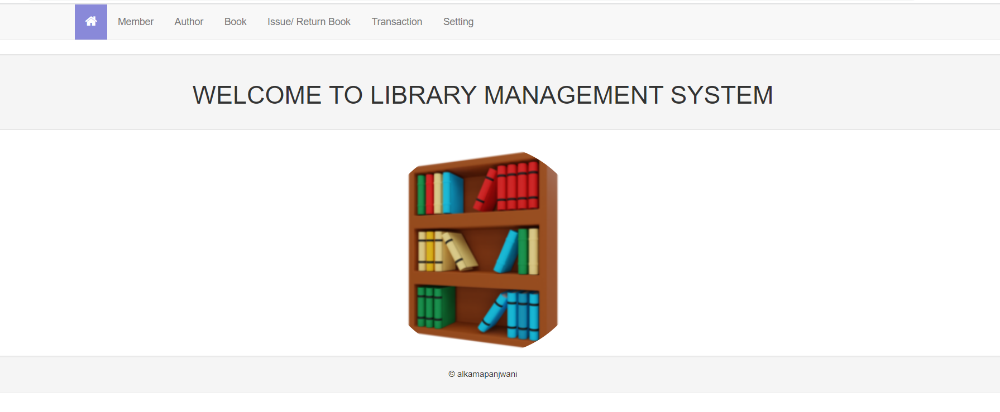
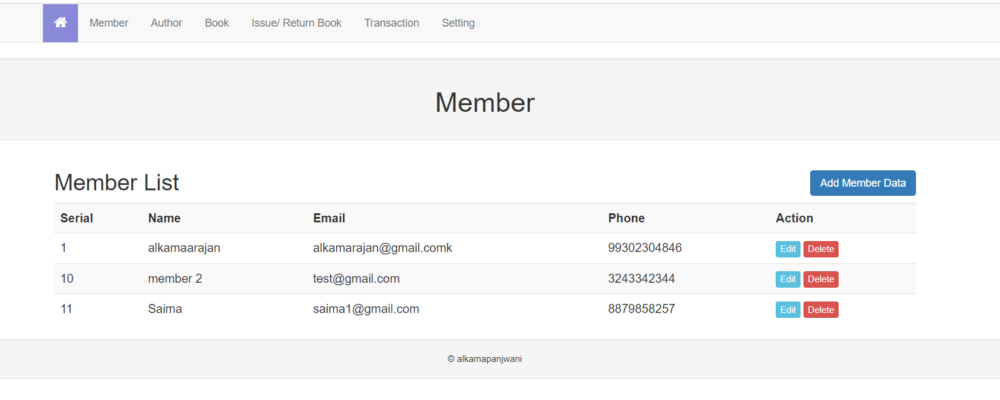

# **Library Management**

_Alkama Panjwani_

## Table of contents

* [Introduction](#introduction)
* [Technologies](#technologies)
* [Demo](#demo)
* [Setup](#setup)
* [Screenshots](#screenshots)
* [To Do](#to-do)

## **Introduction**

Library Management is an web application that handles day to day activities of a librarian. It has features like managing books, members, issue/return book process, payments and dues of member. 
The application is created for a hiring test.

## **Technologies**

Project is created with:
*  Bootstrap 3
*  JQuery 3
*  Flask 2
*  Python 3
*  Html
*  MySQL 

## **Demo**

Project is deployed on pythonanywhere. The link to access the application is:
[http://alkamarajan.pythonanywhere.com/]

_NOTE:_
1. _All the features are available on deployed site except 'Import books from API', as pythonanywhere allows only whitelisted sites to be accessed for free accounts._
2. _Application is running on backwaard compatibility mode on python verion 3.10 and was developed on 3.11_

## **Setup**

To run this project on your local machine, follow the steps below:
1. Install MySQL
2. Install Python 3.11 
3. git clone [https://github.com/alkamapanjwani/libraryManagement.git]
4. Commands to setup on  macOS/ Linux
    ```
    $ cd libraryManagement
    $ python3 -m venv venv
    $ . venv/bin/activate   
    ```
5. Commands to setup on  Windows
    ```
    > cd libraryManagement
    > py -3 -m venv venv
    > venv\Scripts\activate
    ```
6. Within the activated environment, use the following command to install Flask:
    ```
    $ pip install Flask
    ```
7. Within the activated environment, use the following command to install all the requirements:
    ```
    python -m pip install -r requirements.txt
    ```
8. Within the activated environment, use the following command to run the app
    ```
    $ flask --app app run
    ```
   OR
9. Within the activated environment, use the following command to run the app in debug mode
    ```
    $ flask --app app run --debug
    ```

## **Screenshots**

### Landing Page


### Member Liat


## **To Do**

The following are proposed enhancements:
* User and Role management with login and sessions 
* Bulk inserts for pull from API
* Maintain error logs
* Closing_balance and start_balance logic for transaction for each year per member to reduce load 
* Async calls to avoid reloading
* Pagination
* Better UI/ UX
* Additional checks such as maximum number of books that can be issued to a member simultaneously, late return, etc.

